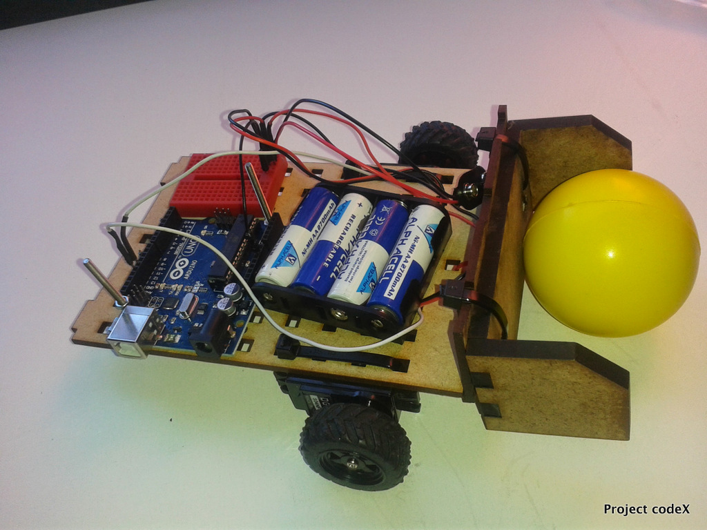
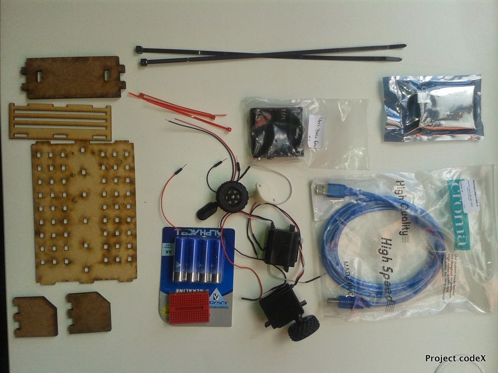
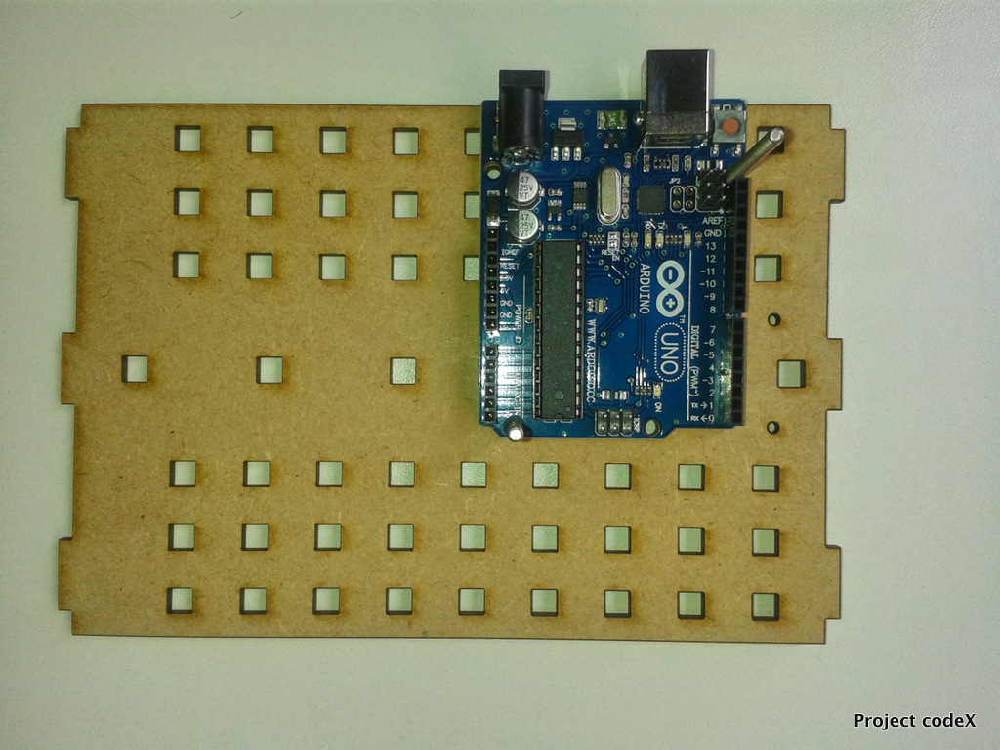
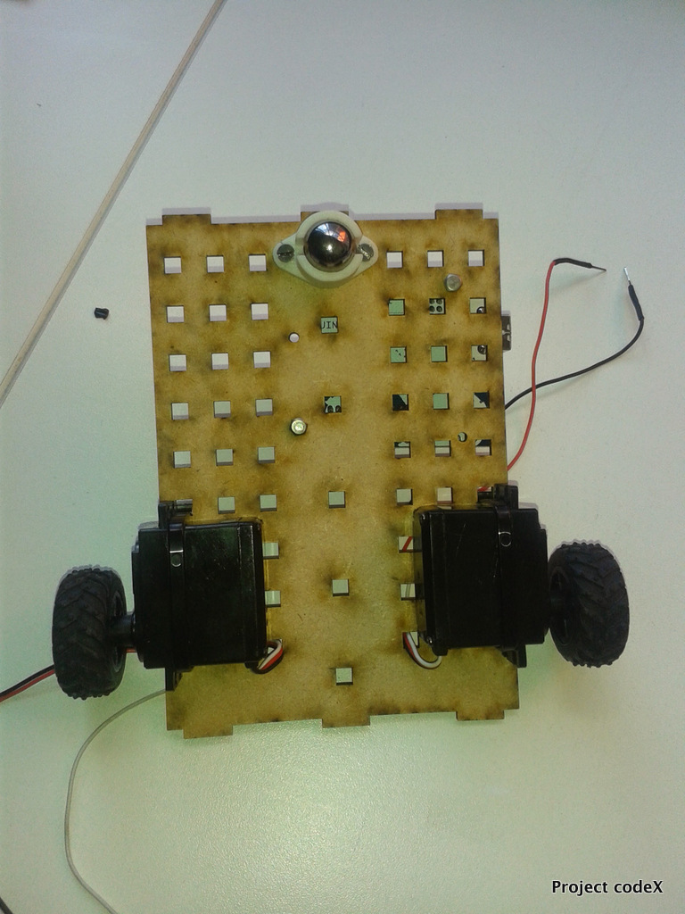
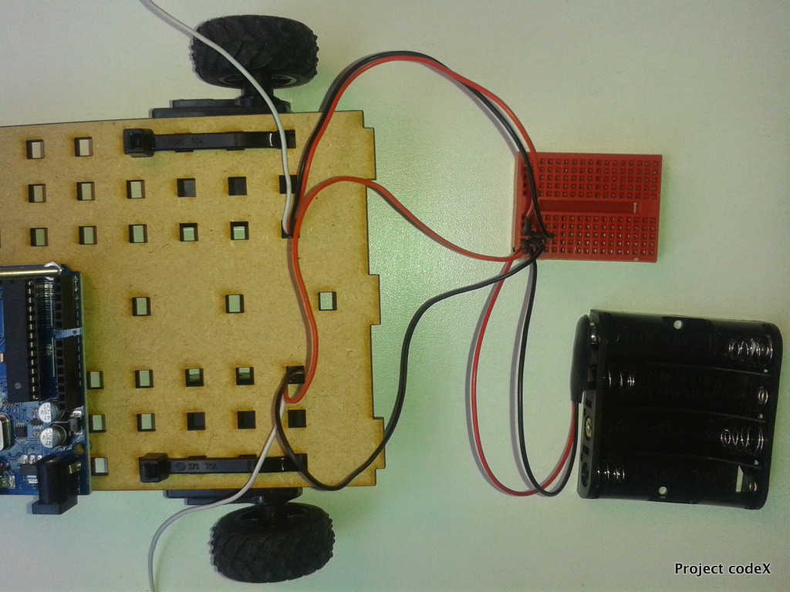
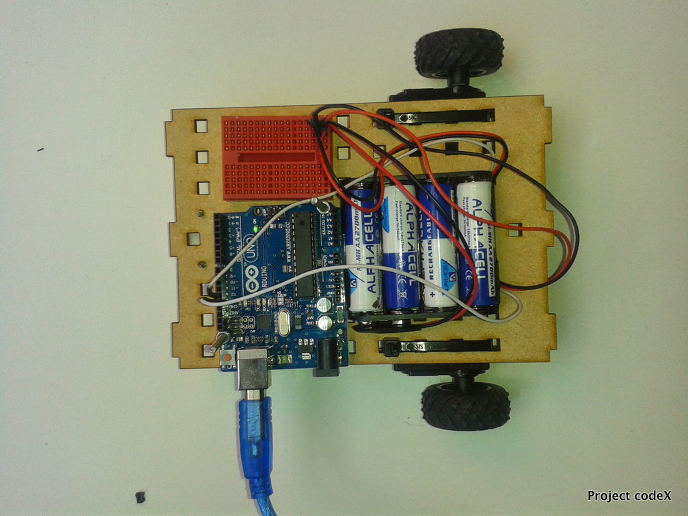

#Battlebot

Here is what you will be building...



Attach the Arduino to the chassis - make sure the green dot is on top.



Attach the servos - to the bottom of the chassis using the 2 cable ties



Attach the omni wheel using the screws supplied, there are 2 holes underneath the chassis for attaching it.



* Attach the wheels to the servos
* Attach the battery pack to the breadboard, now attach the servo wires to the breadboard make sure the red 
and black wires are attached correctly on the breadboard.



* Add the batteries to the battery pack
* Now move the battery pack and the breadboard onto the chassis. Stick them using double sided tape and tick-tack.



* Attach the white servo wires to the Arduino, to pins 12 & 13
* Attach the ground wires from the Servos to ground on the Arduino.

Attach you Nodebot to the laptop and take it for a spin.

To run it use this command : ```node battlebot.js```
	
Now add scoop to ready for battle:

	* First attach the scoop holder using one cable ties
	* Attach it on the opposite end of the omni wheel
	* Then add the scoop itself with 2 bigger cables ties, be sure not to attach the scoop to high.

